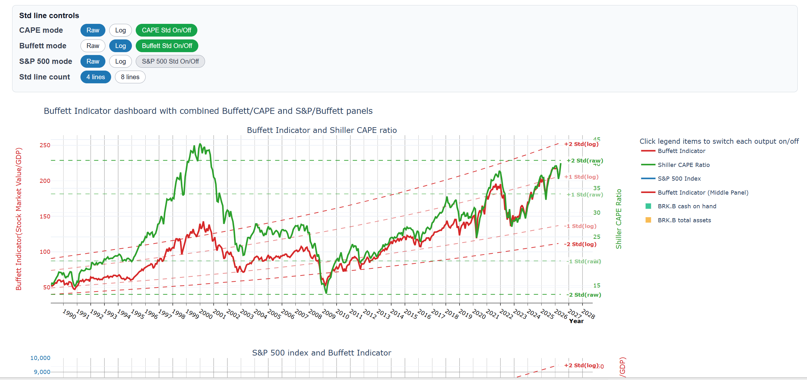
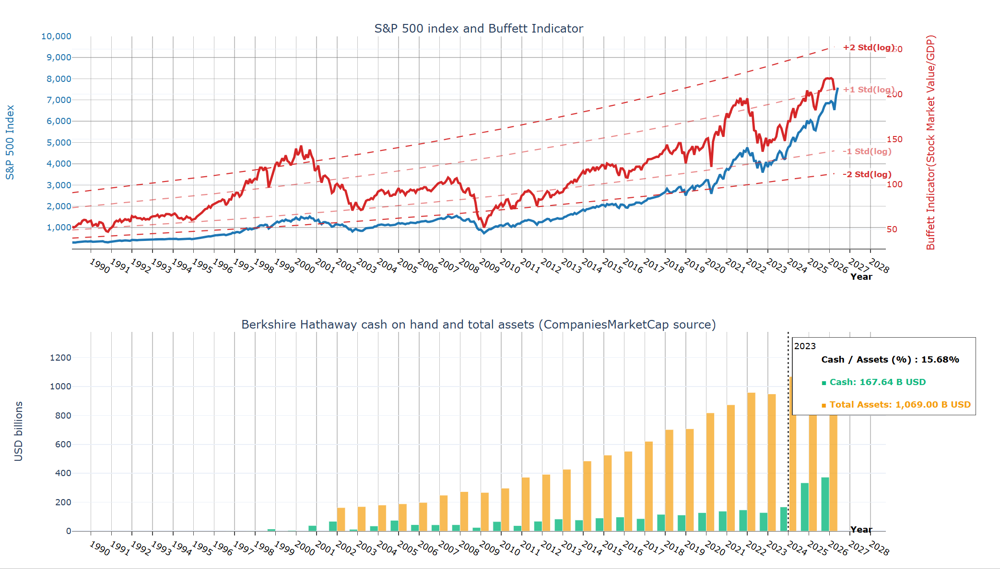

# Buffett Indicator + Shiller CAPE + Berkshire Cash Dashboard

A Python crawler and dashboard generator that downloads public market and macroeconomic data, builds valuation indicators, and exports both an interactive Plotly dashboard and an audit-friendly Excel workbook.

> **Not investment advice.** This project is for research, visualization, and data auditing only. The underlying sources can revise, lag, change page structure, or become temporarily unavailable.

## What this script does

The crawler collects and combines data from several public sources:

- **Yahoo Finance / yfinance** — Wilshire 5000 and S&P 500 price history.
- **FRED** — U.S. nominal GDP and Wilshire 5000 index data.
- **Robert Shiller data workbook** — S&P and CAPE history.
- **CompaniesMarketCap** — Berkshire Hathaway cash on hand and total assets.

It then creates:

- A multi-panel interactive valuation dashboard.
- Standard-deviation bands for CAPE, Buffett Indicator, and optionally S&P 500.
- A merged monthly dataset for easier analysis.
- Raw and audit sheets in Excel so downloaded inputs can be inspected.

## Outputs

By default, running the script creates these files in the current directory:

```text
buffett_dashboard.html
buffett_dashboard.xlsx
```

### `buffett_dashboard.html`

Interactive Plotly dashboard with:

- Buffett Indicator.
- Shiller CAPE and S&P 500 history.
- Berkshire Hathaway cash, total assets, and cash-to-assets ratio.
- Legend-based series toggles.
- Custom standard-deviation controls for switching raw/log bands and line counts.


## HTML dashboard UI preview

The generated `buffett_dashboard.html` is an interactive Plotly dashboard. The page combines long-term valuation indicators, market index history, Berkshire Hathaway liquidity data, and browser-side controls for showing or hiding statistical reference lines.

### Full dashboard view


The full dashboard view shows the custom **Std line controls** panel at the top, followed by the main chart area. The first chart panel compares the **Buffett Indicator** with the **Shiller CAPE ratio** and their standard-deviation reference lines. The legend on the right can be clicked to show or hide each output series.

### Lower chart panels and hover annotation



The lower dashboard panels show the **S&P 500 index and Buffett Indicator** together, plus **Berkshire Hathaway cash on hand and total assets** as bar charts. When users hover over a data point or bar, the dashboard displays contextual values such as year, cash/assets percentage, cash amount, and total assets.

### Brief UI introduction

- **Std line controls** — switch CAPE, Buffett Indicator, and S&P 500 standard-deviation bands between `Raw` and `Log` modes.
- **On/Off buttons** — show or hide each group of standard-deviation lines without regenerating the dashboard.
- **Std line count** — choose between `4 lines` for a cleaner view or `8 lines` for more granular valuation bands.
- **Legend** — click a series name to show or hide it in the chart.
- **Hover labels** — move the mouse over lines or bars to inspect exact values by year/date.
- **Zoom and pan** — use Plotly's built-in interactions to inspect specific historical periods.

### `buffett_dashboard.xlsx`

Excel workbook containing native-frequency and merged data sheets:

- `Buffett`
- `Shiller_SP500`
- `SP500_Yahoo`
- `Berkshire_Merged`
- `Berkshire_CMC_Cash`
- `Berkshire_CMC_Assets`
- `Berkshire_Audit`
- `Combined`

## Requirements
### Python 3.10 or newer is recommended. Python 3.9 is the minimum expected version.

### Automatically install libraries with step0_install.bat
The Users normally need to install additional Python libraries before running this script.

The script uses standard-library modules such as `argparse`, `io`, `json`, `math`, `os`, `re`, `time`, `urllib`, `dataclasses`, `pathlib`, and `typing`. Those come with Python and do **not** need separate installation.

It also imports third-party packages that usually must be installed with `pip`:

- `numpy`
- `pandas`
- `plotly`
- `requests`
- `yfinance`
- `openpyxl`
- `xlrd`


```bash
pip install numpy pandas plotly requests yfinance openpyxl xlrd
```

If your system has multiple Python versions, use:

```bash
python -m pip install numpy pandas plotly requests yfinance openpyxl xlrd
```

or:

```bash
python3 -m pip install numpy pandas plotly requests yfinance openpyxl xlrd
```

### Why these packages are needed

- `numpy` — numerical calculations and standard-deviation band calculations.
- `pandas` — data cleaning, merging, date handling, CSV/Excel processing, and workbook export.
- `plotly` — interactive HTML dashboard generation.
- `requests` — direct HTTP downloads from FRED, Shiller, and CompaniesMarketCap pages.
- `yfinance` — Yahoo Finance historical market data downloads.
- `openpyxl` — writing the generated `.xlsx` workbook.
- `xlrd` — reading older `.xls` workbooks, including Shiller's workbook format.

### Optional: create an isolated virtual environment

Recommended for repeatable runs:

```bash
python -m venv .venv

# macOS / Linux
source .venv/bin/activate

# Windows PowerShell
.venv\Scripts\Activate.ps1

pip install numpy pandas plotly requests yfinance openpyxl xlrd
```

### Optional: save dependencies to `requirements.txt`

You can create a `requirements.txt` file with:

```text
numpy
pandas
plotly
requests
yfinance
openpyxl
xlrd
```

Then install everything with:

```bash
pip install -r requirements.txt
```

## Quick start

Run with an explicit user agent:

```bash
python buffett_dashboard.py --user-agent "Your Name your.email@example.com"
```

The script prints progress messages while downloading and processing data, then writes the HTML dashboard and Excel workbook.

## How to launch `buffett_dashboard.html`

After the script finishes, open the generated HTML file in a web browser.

### Option 1: Double-click the file

1. Run the crawler:

   ```bash
   python buffett_dashboard.py --user-agent "Your Name your.email@example.com"
   ```

2. Find `buffett_dashboard.html` in the output directory.
3. Double-click the file to open it in your default browser.

This is the simplest method and works well when your browser allows local HTML files to load JavaScript from the Plotly CDN.

### Option 2: Open from the command line

Use the command for your operating system:

```bash
# macOS
open buffett_dashboard.html

# Windows PowerShell
start buffett_dashboard.html

# Linux
xdg-open buffett_dashboard.html
```

If you used `--output-dir`, open the file from that directory instead:

```bash
python buffett_dashboard.py --output-dir output --user-agent "Your Name your.email@example.com"
open output/buffett_dashboard.html
```

### Option 3: Serve the folder locally

If your browser or security settings block local JavaScript, serve the project folder with Python's built-in HTTP server:

```bash
python -m http.server 8000
```

Then open:

```text
http://localhost:8000/buffett_dashboard.html
```

If the dashboard is inside an output folder, open:

```text
http://localhost:8000/output/buffett_dashboard.html
```

### Offline note

By default, the generated HTML loads Plotly from a CDN. If you need the dashboard to work without internet access, edit `save_dashboard_html()` in `buffett_dashboard.py` and change:

```python
include_plotlyjs="cdn"
```

to:

```python
include_plotlyjs=True
```

Then rerun the script. The HTML file will be larger, but it will include Plotly directly.

## Using the dashboard UI

The dashboard has two kinds of controls:

1. **Plotly's built-in chart controls** in the chart area.
2. **Custom `Std line controls` buttons** above the dashboard.

### Legend controls

The chart legend is an on/off switch for plotted series.

- Click a legend item once to hide or show that series.
- For grouped items, such as Buffett bands or CAPE bands, toggling the legend affects the whole related group.
- Use this to simplify the view when too many lines are visible.

### Hovering and reading values

Move your mouse over the chart to inspect values by date.

- The dashboard uses a shared time axis, so the panels are meant to be compared across the same historical period.
- Hover labels help check the exact values behind each visible line.

### Zooming and panning

Use standard Plotly interactions:

- Drag across the chart to zoom into a date range.
- Double-click the chart to reset the zoom.
- Use the modebar controls in the top-right of the chart for zoom, pan, autoscale, reset, and image export.

## `Std line controls` buttons

The custom button panel controls how standard-deviation reference lines are displayed.

### CAPE mode

Buttons:

```text
Raw | Log | CAPE Std On/Off
```

- **Raw** shows CAPE bands as mean plus/minus standard-deviation levels.
- **Log** shows CAPE bands around a log-linear trend.
- **CAPE Std On/Off** shows or hides CAPE standard-deviation lines.

Use raw mode when you want simple absolute CAPE thresholds. Use log mode when you want trend-adjusted bands.

### Buffett mode

Buttons:

```text
Raw | Log | Buffett Std On/Off
```

- **Raw** shows Buffett Indicator bands as mean plus/minus standard-deviation levels.
- **Log** shows Buffett Indicator bands around a log-linear trend.
- **Buffett Std On/Off** shows or hides Buffett Indicator standard-deviation lines.

The default mode is **Log**, because proportional trend lines are easier to interpret across long market-history windows.

### S&P 500 mode

Buttons:

```text
Raw | Log | S&P 500 Std On/Off
```

- **Raw** shows S&P 500 bands as mean plus/minus standard-deviation levels.
- **Log** shows S&P 500 bands around a log-linear trend.
- **S&P 500 Std On/Off** shows or hides S&P 500 standard-deviation lines.

The S&P 500 standard-deviation lines are hidden by default to keep the dashboard less cluttered. Turn them on when you want to compare price history against its own statistical bands.

### Std line count

Buttons:

```text
4 lines | 8 lines
```

- **4 lines** shows only `+1`, `+2`, `-1`, and `-2` standard-deviation lines.
- **8 lines** adds `+0.5`, `+1.5`, `-0.5`, and `-1.5` lines.

Use **4 lines** for a cleaner dashboard. Use **8 lines** when you want more granular valuation zones.

### Button colors

The button colors indicate state:

- Blue button: currently selected mode, such as `Raw`, `Log`, `4 lines`, or `8 lines`.
- Green toggle: standard-deviation lines for that group are currently on.
- Red toggle: standard-deviation lines for that group are currently off.

### Important behavior

- The buttons only change the current dashboard view in the browser.
- They do not rewrite the Excel workbook.
- They do not persist settings after you close or refresh the page.
- To change the dashboard's initial state, rerun the script with the relevant command-line options.

Example:

```bash
python buffett_dashboard.py \
  --stddev-lines 8 \
  --cape-stddev-mode log \
  --buffett-stddev-mode log \
  --sp500-std-lines \
  --user-agent "Your Name your.email@example.com"
```

## Command-line options

```bash
python buffett_dashboard.py \
  --start 1989-01-01 \
  --output-dir output \
  --html-name buffett_dashboard.html \
  --excel-name buffett_dashboard.xlsx \
  --cape-stddev-mode raw \
  --buffett-stddev-mode log \
  --sp500-stddev-mode raw \
  --stddev-lines 4 \
  --user-agent "Your Name your.email@example.com"
```

### Main options

| Option | Default | Description |
|---|---:|---|
| `--start` | `1989-01-01` | Start date for displayed data. |
| `--output-dir` | `.` | Directory where output files are saved. |
| `--html-name` | `buffett_dashboard.html` | Output HTML dashboard filename. |
| `--excel-name` | `buffett_dashboard.xlsx` | Output Excel workbook filename. |
| `--user-agent` | environment/user fallback | HTTP user agent used for requests. |

### Standard-deviation options

| Option | Choices | Default | Description |
|---|---|---:|---|
| `--cape-stddev-mode` | `raw`, `log` | `raw` | CAPE band method. |
| `--buffett-stddev-mode` | `raw`, `log` | `log` | Buffett Indicator band method. |
| `--sp500-stddev-mode` | `raw`, `log` | `raw` | S&P 500 band method. |
| `--stddev-lines` | `4  `, `8  ` | `4  ` | `4` only shows ±1 and ±2; `8` shows additional ±0.5 and ±1.5 |

### Initial visibility toggles

```bash
--cape-std-lines / --no-cape-std-lines
--buffett-std-lines / --no-buffett-std-lines
--sp500-std-lines / --no-sp500-std-lines
```

Defaults:

- CAPE standard-deviation lines: **on**.
- Buffett Indicator standard-deviation lines: **on**.
- S&P 500 standard-deviation lines: **off**.

Example with all bands visible at startup:

```bash
python buffett_dashboard.py \
  --sp500-std-lines \
  --stddev-lines 8 \
  --user-agent "Your Name your.email@example.com"
```

### Conflicting visibility flags

Avoid passing both the positive and negative form of the same visibility flag in one command.

For example, avoid:

```bash
python buffett_dashboard.py --cape-std-lines --no-cape-std-lines
```

`argparse` accepts both, but the **last flag wins**. In the example above, CAPE standard-deviation lines will be hidden initially because `--no-cape-std-lines` appears last.

Use only one form:

```bash
# Show CAPE standard-deviation lines initially
python buffett_dashboard.py --cape-std-lines

# Hide CAPE standard-deviation lines initially
python buffett_dashboard.py --no-cape-std-lines
```

## Data methodology

### Buffett Indicator

The Buffett Indicator is built from market capitalization data and U.S. nominal GDP. The script aligns the series over time and calculates valuation levels for visualization.

### Shiller CAPE and S&P 500

The script downloads Robert Shiller's data workbook, standardizes the workbook into monthly observations, and uses the S&P/CAPE history for charting and band calculations.

### Berkshire Hathaway liquidity

Berkshire Hathaway cash and total assets are sourced from CompaniesMarketCap only. This avoids mixing incompatible definitions, such as broad cash-on-hand figures versus narrower SEC cash taxonomies.

### Standard-deviation bands

The dashboard supports two band styles:

- **Raw mode** — mean plus/minus standard deviation levels.
- **Log mode** — log-linear trend with standard-deviation bands around log residuals.

The default uses log bands for the Buffett Indicator because proportional trend lines are more readable over long time horizons.

## Environment variables

You can provide the user agent through an environment variable instead of the CLI:

```bash
export HTTP_USER_AGENT="Your Name your.email@example.com"
python buffett_dashboard.py
```

The script also checks `SEC_USER_AGENT` as a fallback.

## Troubleshooting

### `ModuleNotFoundError: No module named ...`

This means a required third-party library is missing from your Python environment.

Install all required packages:

```bash
python -m pip install numpy pandas plotly requests yfinance openpyxl xlrd
```

Then rerun:

```bash
python buffett_dashboard.py --user-agent "Your Name your.email@example.com"
```

If you use a virtual environment, make sure it is activated before installing and running the script.

### Downloads fail or return empty data

Potential causes:

- Temporary source outage.
- Network or firewall issue.
- Website layout changed.
- User agent blocked or too generic.

Try:

```bash
python buffett_dashboard.py --user-agent "Your Name your.email@example.com"
```

### `buffett_dashboard.html` opens but the chart is blank

Try these fixes:

- Confirm you are connected to the internet because Plotly is loaded from a CDN by default.
- Refresh the page.
- Open the browser developer console and check for blocked JavaScript or network errors.
- Serve the folder locally with `python -m http.server 8000` and open the page through `localhost`.
- If offline use is required, embed Plotly directly by changing `include_plotlyjs="cdn"` to `include_plotlyjs=True` and rerunning the script.

### Buttons do not appear

The custom button panel is injected into the generated HTML by `save_dashboard_html()`. Make sure you are opening the generated `buffett_dashboard.html`, not an older exported Plotly file or a copied chart fragment.

### Shiller data looks stale

The script attempts to discover current Shiller workbook URLs and falls back to the legacy Yale workbook if needed. If the workbook source lags, CAPE history may not include the latest months.

### CompaniesMarketCap parsing breaks

CompaniesMarketCap pages are parsed from public webpage content. If the website changes its embedded data format or markup, the parser may need to be updated.

## Suggested project structure

```text
.
├── buffett_dashboard.py
├── README.md
├── requirements.txt
└── output/
    ├── buffett_dashboard.html
    └── buffett_dashboard.xlsx
```

## Reproducibility notes

- Some data sources revise historical values.
- Yahoo Finance and webpage-derived data can change without notice.
- The Excel workbook is intended to make source-level auditing easier.
- For long-term reproducibility, archive generated `.xlsx` outputs alongside the dashboard.

## License

No license is specified in this repository yet. Add a license before distributing or publishing the project.
